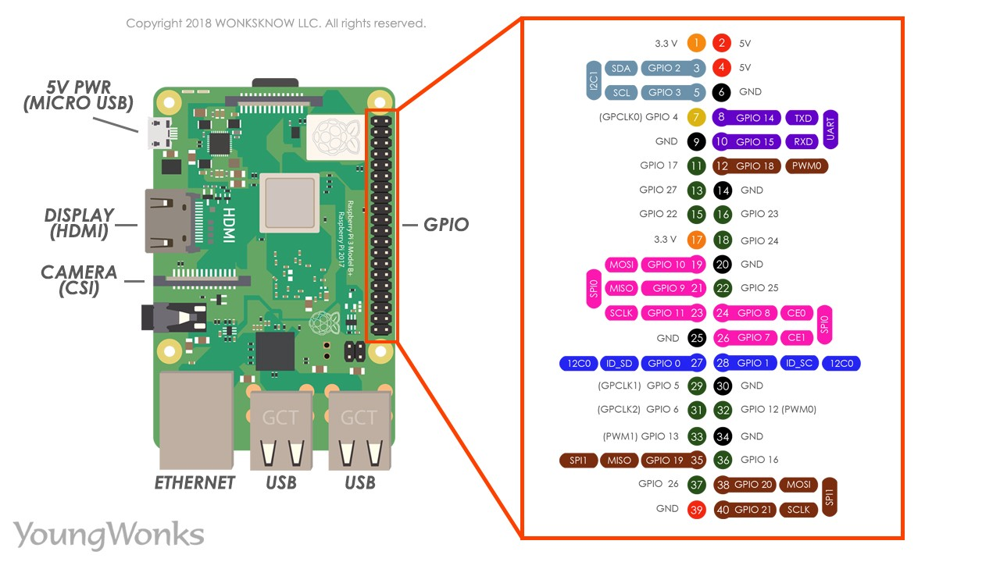

# Boberto: 2019 IEEE Open Robot Competition

Boberto was a robot developed by six students of LAR-UFRN (https://github.com/lar-ect). The competition consisted in proposig, developing and manufacturing a robot able to solve a portuary challenge.

The main goal was deposit as much containers as possible in a enviroment with a simulation of two ships (one blue and other green) and one train (red). Each container had a different pontuation. The team with the greatest score would win the challenge.

Boberto was able to:
1. Identify and advance to a container zone;
2. Choose a container to pick and check its color;
3. If it consisted in a Blue/Green container, grab it and go to the ship zone;
4. If it consisted in a Red container, ignore it and keep moving to the next pile;
5. Come back and do it all over again;

The official document of the competition can be found bellow:

[Rules](http://www.cbrobotica.org/wp-content/uploads/OPEN2018_2019_en.pdf)

## Pinout do Boberto

### Motor de Passo

| Port      | Pin     |
|:--------: |:-------:|
| Dir       | 52      |
| Step      | 50      |
| Enable    | 13      |

### Ponte H1

| Port      | Pin     |
|:--------: |:-------:|
| Claw_DC 1 | 11      |
| Claw_DC 2 | 12      |
| Motor 2.1 | 9       |
| Motor 2.2 | 10      |


### Ponte H2

| Port         | Pin     |
|:-----------: |:-------:|
| Back Left 2  | 7       |
| Back Left 1  | 8       |
| Back Right 2 | 6       |
| Back Right 1 | 5       |

### Ponte H3

| Port          | Pin     |
|:-------------:|:-------:|
| Front Right 1 | 45      |
| Front Right 2 | 4       |
| Front Left 1  | 46      |
| Front Left 2  | 44      |

### Encoders

| Port       | Pin     |
|:----------:|:-------:|
| Back Left  | 3       |
| Back Right | 2       |
| Front Right| 18      |
| Front Left | 19      |

## Utilizando [PlatformIO Cli](http://docs.platformio.org/en/latest/)

* Instalação

```console
user@computer:~$ sudo python -c "$(curl -fsSL https://raw.githubusercontent.com/platformio/platformio/develop/scripts/get-platformio.py)"
```

* Upload de código

```console
user@computer:~/IEEE-2019 $ pio run -t upload --upload-port=/dev/ttyUSB0
```

## Esquemático das coisas



